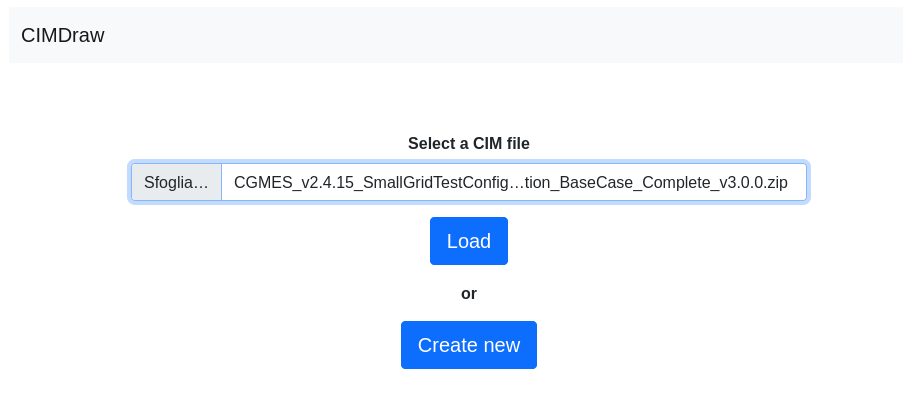
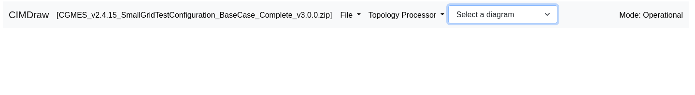
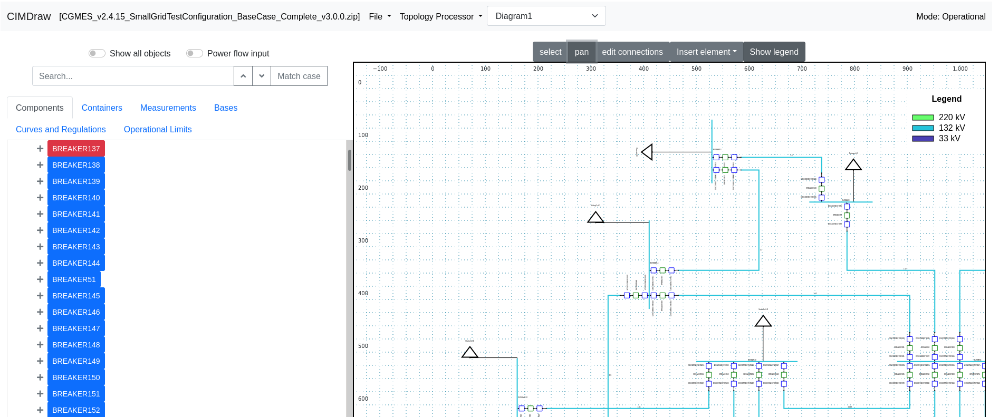
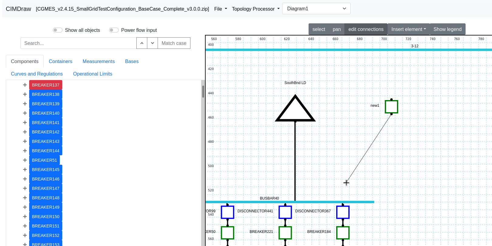
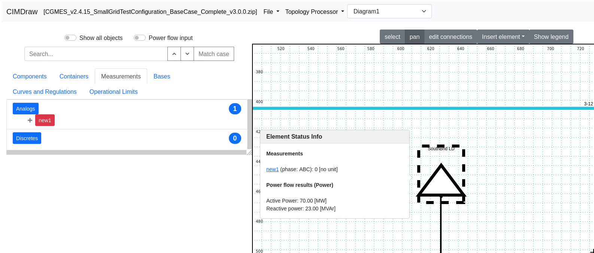

# CIMDraw #

These are the source files for CIMDraw.

### What is this? ###

CIMDraw is a WebApp to view IEC CIM files (**[ENTSO-E CGMES profile](https://www.entsoe.eu/major-projects/common-information-model-cim/cim-for-grid-models-exchange/standards/Pages/default.aspx), node-breaker representation**). 
Editing is also possible, with some limitations (see below).
The code uses many ES6 features, so you will need a modern browser to run it
(Firefox >= 44, Chrome >= 49).

### Acknowledgement ###

This work has been financed by the Research Fund for the Italian Electrical System under the Contract Agreement between **[RSE S.p.A.](http://www.rse-web.it/home.page?country=eng)** and the Ministry of Economic Development - General Directorate for Nuclear Energy, Renewable Energy and Energy Efficiency in compliance with the Decree of March 8, 2006.

### Resources ###

- [Online demo](https://cimdraw.bitbucket.io/)
- [Wiki](https://bitbucket.org/danielePala/cimdraw/wiki/Home)
- [Code architecture and API reference](https://bitbucket.org/danielePala/cimdraw/wiki/API.md)
- [Examples](https://bitbucket.org/danielePala/cimdraw/wiki/Examples.md)

### Installing ###

In order to use the application, just serve it with your favorite web server
and view it with your browser.

### Using ###

The app starts by asking for a CIM file: you can load one RDF/XML file,
or a split representation with many files (e.g. EQ, DL, SV etc) according to 
the [ENTSO-E CGMES profile](https://www.entsoe.eu/major-projects/common-information-model-cim/cim-for-grid-models-exchange/standards/Pages/default.aspx).
In the second case, you just load the whole zip file, no need to uncompress it.
Alternatively, it is possible to create a new file from scratch. In any case (new file or editing of an existing file), it is possible to choose the preferred output format. At the moment **only node-breaker network representations are fully supported** but experimental support for bus-branch representations is already present and can be tested. 

Once loaded, the app shows a dropdown list of diagrams: choose a diagram and it
will be loaded. Alternatively, you can create a new diagram.

Once loaded, you will get a tree view of all the objects in the diagram and a single line diagram.
You can move and zoom on the diagram by holding down the CTRL key. If you click on an element in the tree, the diagram will focus on that element. If you CTRL+click an element in the diagram, you will see it also in the tree. The attributes in the tree can be edited.
Also, the links between objects can be changed, just click the 'change' button and then click on the target element.

By default the tree only shows the elements of the current diagram: you can check the 'Show all objects' flag in order to see all the elements in the file. You can drag and drop from the tree to the diagram in order to add elements to the diagram; if you drag+drop an element which is already in the diagram, the diagram will focus on that element.

By default, the 'select' control is selected for the diagram, which allows you to drag elements. The 'force (auto-layout)' control moves elements around according to a force-based algorithm. The 'edit connections' control allows you to change connections between elements: first click on a terminal and then click on another terminal (or on a busbar).

The 'Insert element' controls allows you to add elements to the diagram.
You can right-click on an element in the diagram in order to rotate, delete 
or add measurements to it. Measurements and other status information are shown by right-clicking on the
element and selecting the "Show element info" option.

Finally, you can save the modified file ('Save as...') and also save the current diagram only ('Export current diagram').

### Data model ###

The attributes shown in the tree are taken from the schema file located inside the 'rdf-schema' folder, and it is the [ENTSO-E CGMES](https://www.entsoe.eu/major-projects/common-information-model-cim/cim-for-grid-models-exchange/standards/Pages/default.aspx) equipment schema with the addition of the 'Jumper' object.

### Known bugs/limitations ###

- At the moment there is no auto-save functionality. This will surely be 
implemented in the future, probably by using IndexedDB.
- Not all of the CGMES elements are supported, only the most needed ones.
You are welcome to contribute by supporting more elements, or by adding
issues for discussing the addition of elements.
- Only node-breaker network representations are supported. Contributions are welcome for adding bus-branch support.
- CGMES files containing multiple EQ or DL files are not supported right now.

### License ###

See the COPYING file.